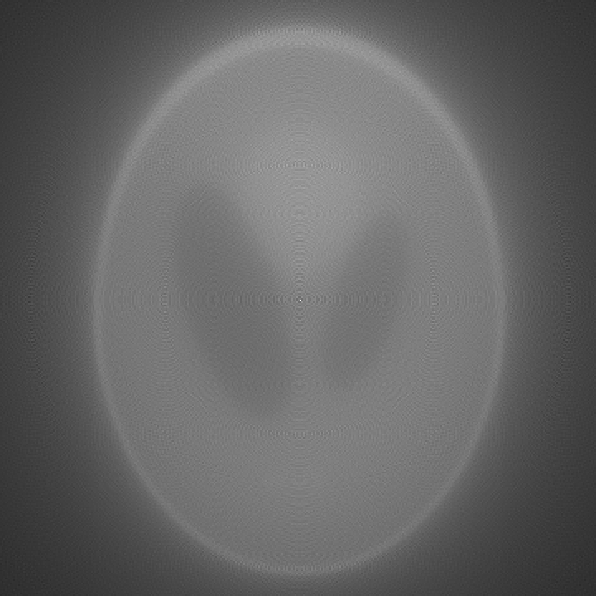

# radon-tf
Simple opencv radon transform implementation (no Fourier slice theorem or filtering is applied). The implementation is as straightforward as it gets. Example of usage is found in `main.cpp`. The `sinogram()` function can be speeded up by giving it a thread count. Tests have shown that one can get up to the number of cores of this computer in speed up factor. This is due to the straightforward approach. Each thread gets an interval of angles to work with and the final image is computed at the end.

